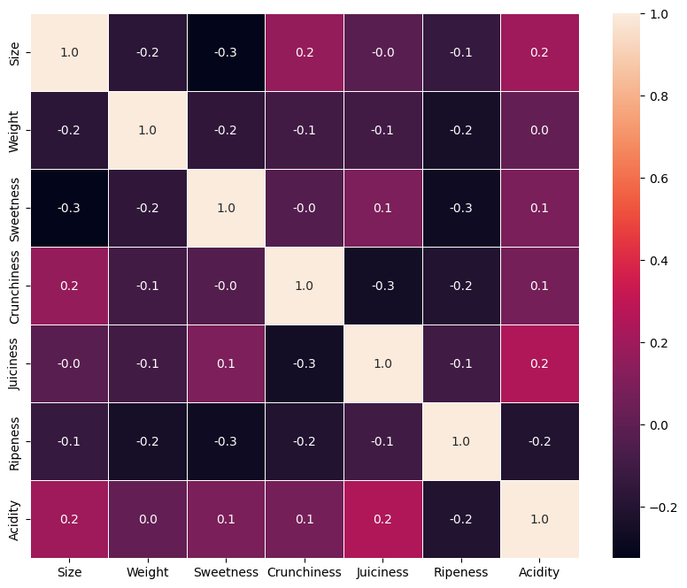
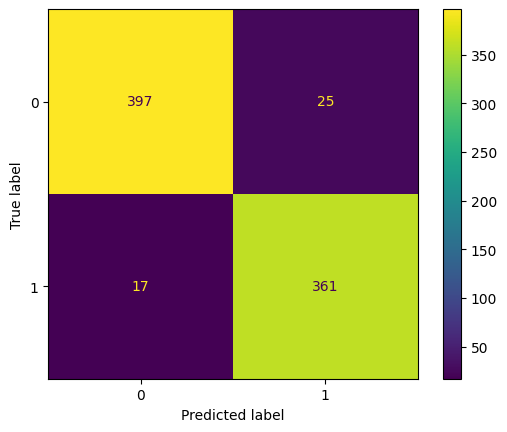
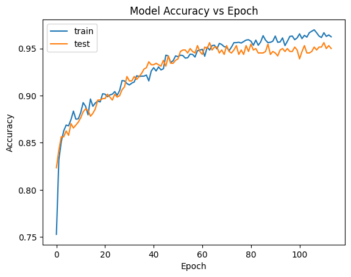

# Apple Quality Prediction and Classification

## Dataset
https://www.kaggle.com/datasets/nelgiriyewithana/apple-quality 

## Python modules that I used
Pandas, Tensorflor, sklearn, Numpy, Matplotlib, seaborn, scipy

## Some keywords
MLP (Multilayer Perceptron), Hyperparameter Tuning, Neural Network

## Introduction and Potential Use Cases

This report aims to showcase my skills in data analysis and machine learning by exploring and analyzing an Apple Quality dataset. The dataset contains various attributes of apples, such as size, weight, sweetness, crunchiness, juiciness, ripeness, acidity, and quality rating. The quality rating is either good or bad, indicating whether the apple is suitable for consumption or not.

Objecive:
- **Quality Prediction**: Predicting the quality rating of apples using various attributes, which could be beneficial for quality control and sorting processes. This could help reduce waste, improve customer satisfaction, and optimize production efficiency.

## Data Cleaning and Exploration

Before proceeding with the analysis, I performed some data cleaning and exploration steps to understand the structure and distribution of the dataset. These steps included:

- Removing unnecessary columns and addressing any issues with data types.
- Extracting and storing the quality and id columns before removal.
- Converting the acidity column to numeric as it was incorrectly typed as object.
- Plotting a correlation map to visualize the relationships between the attributes.
- Splitting the dataset into training and test sets, which will enable me to train and evaluate the models on different subsets of data[8].



## Machine Learning Models and Evaluation

To select a suitable machine learning model for predicting apple quality, I considered several factors, such as accuracy, interpretability, and computational efficiency. I tried various classifiers, including logistic regression, decision tree, random forest, gradient boosting, SVM, KNN, naive Bayes, LightGBM, and MLP. The evaluation was based on:

- **Accuracy**: The proportion of correct predictions among the total number of predictions.
- **Precision**: The proportion of correct positive predictions among the total number of positive predictions.
- **Recall**: The proportion of correct positive predictions among the total number of actual positives.
- **ROC**: The area under the receiver operating characteristic curve, which plots the true positive rate against the false positive rate at different thresholds.

The results of the evaluation are shown in the table below:

| Classifier            | Testing Accuracy | Testing Precision | Testing Recall | ROC   |
|-----------------------|------------------|-------------------|----------------|-------|
| Logistic Regression   | 0.75250          | 0.722772          | 0.772487       | 0.751 |
| Decision Tree         | 0.72500          | 0.651923          | 0.896825       | 0.724 |
| Random Forest         | 0.83125          | 0.784543          | 0.886243       | 0.831 |
| Gradient Boosting     | 0.86125          | 0.829630          | 0.888889       | 0.861 |
| SVM                   | 0.89500          | 0.858537          | 0.931217       | 0.895 |
| K-Nearest Neighbors   | 0.89125          | 0.855746          | 0.925926       | 0.891 |
| Gaussian Naive Bayes  | 0.75000          | 0.719212          | 0.772487       | 0.749 |
| Bernoulli Naive Bayes | 0.65875          | 0.622378          | 0.706349       | 0.657 |
| LightGBM              | 0.89250          | 0.863184          | 0.917989       | 0.892 |
| MLP                   | 0.92625          | 0.914286          | 0.931217       | 0.926 |

The MLP classifier had the best accuracy on the test set, followed by the SVM and LightGBM classifiers. It also had the highest precision, recall, and ROC scores, indicating effective classification with minimal false positives and negatives.

To improve the MLP classifier's performance, I performed hyperparameter tuning with randomized search cross-validation, finding the best combination to be:

- **Activation function**: relu
- **Hidden layer size**: (290,)



With these hyperparameters, the MLP classifier achieved an accuracy of 0.9475, precision of 0.9352, recall of 0.9550, and a ROC of 0.9479 on the test set, indicating an improvement.

## Neural Network Model with TensorFlow

To demonstrate proficiency in TensorFlow, I built a neural network model for apple classification. The steps included:

- Standardizing input data using sklearn's StandardScaler.
- Converting data to tensors with `tf.data.Dataset.from_tensor_slices`.
- Defining the model architecture with `tf.keras.Sequential`, including three dense layers with relu activation and dropout layers for regularization. The output layer uses a sigmoid activation function for binary classification.
- Compiling the model with the adam optimizer, binary cross-entropy loss function, and accuracy metric.
- Using callbacks like ReduceLROnPlateau and EarlyStopping during training.
- Training the model with a validation split of 0.2 and evaluating it on the test set.



The evaluation results showed:

- **Test loss**: 0.1571
- **Test accuracy**: 0.9513
- **Test precision**: 0.9352
- **Test recall**: 0.9550
- **Test ROC**: 0.9513

The TensorFlow model achieved similar results to the sklearn MLP classifier, showing both are effective and robust.

## Conclusion and Recommendations

This report demonstrated skills in data analysis and machine learning by exploring an Apple Quality dataset. I performed data cleaning and exploration, applied various machine learning models, evaluated their performance, and improved the best model using hyperparameter tuning. I also built a neural network model using TensorFlow and achieved comparable results.

Based on the analysis, I recommend:

- Using the MLP classifier or the TensorFlow neural network model for predicting the quality of apples.
- Investigating factors influencing apple quality, such as ripeness, sweetness, and acidity, to improve quality.
- Exploring other machine learning models or techniques, like deep learning or ensemble methods, for further performance improvements.
```
